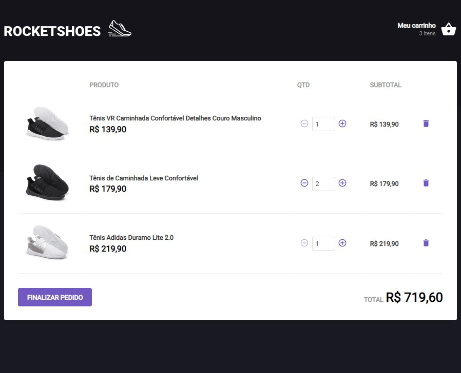

<h1 align="center">RocketShoes</h1>

Bem vindo! Este é o meu código refatorado do projeto RocketShoes. Trata-se de uma aula do curso Ignite da RocketSeat onde é entregue um código não funcional e com desafios propositais no mesmo, para que seja feita uma refatoração. Aqui tivemos 17 testes automatizados que deveriam passar, e no final todos foram sucess.

 

Tecnologias utilizadas:
 React
 Typescript
 Git e GitHub

